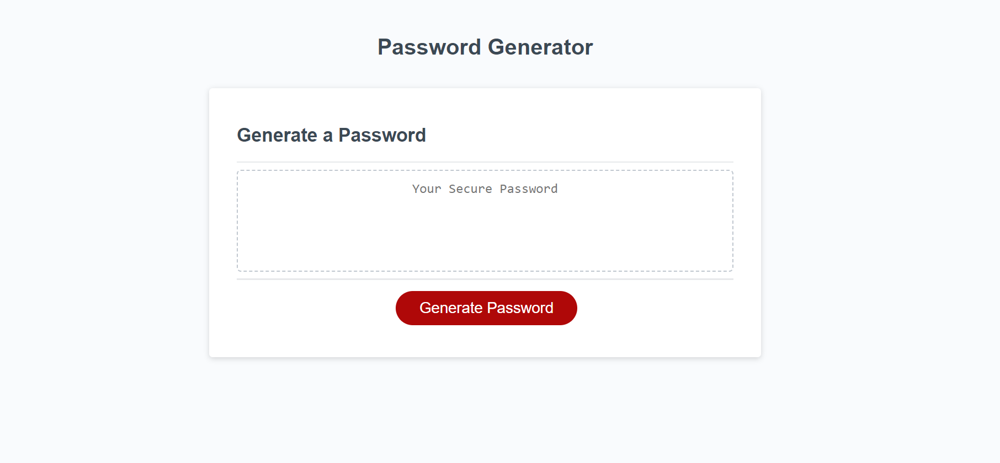

## JavaScript: Password Generator 


## Description

This is a web application that enables employees to generate random passwords based on criteria that they’ve selected. The application runs in the browser and features a clean and polished user interface that adapts to multiple screen sizes. It allows users to select the length of the password and choose which character types to include, such as lowercase letters, uppercase letters, numbers, and special characters. The generated password provides greater security for employees with access to sensitive data.

## Table of Contents

- [Mockup](#mockup)
- [Deployed Application](#deployed-application)
- [Installation](#installation)
- [License](#license)
- [Questions](#questions)

## Mock-Up
The web application's appearance and functionality:



## Deployed Application

Click [here](https://ninabuscemi.github.io/PassGenPro/) to view the live site

## Installation

1. [Download](https://github.com/ninabuscemi/PassGenPro) or clone the repository:

    ```
    git clone git@github.com:ninabuscemi/PassGenPro.git
    ```

2. Open the html link in your local browser

## License

The project is under MIT License.

## Questions

If you have any questions regarding the project, please, feel free to contact me:

- GitHub: [Nina Buscemi](https://github.com/ninabuscemi)